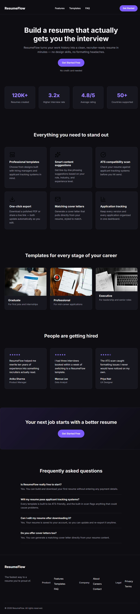

# ResumeFlow — Landing Page

## What this is

This is my weekend build for the Industry-Oriented Full Stack Internship. The task was to build the homepage for an imaginary product called **ResumeFlow**, which helps people create a resume online. The idea is that this is a warm-up for a real resume-building tool we'll build later, so I treated it like the front door of an actual product — something that should look convincing enough that a visitor would actually want to click "Get Started."

## Project info

|               |                                                           |
|---------------|-----------------------------------------------------------|
| **Project**   | Resume-builder marketing landing page (single homepage)   |
| **Tech used** | HTML + CSS, with a small amount of JavaScript             |
| **Repo name** | resume-landing                                            |
| **Hosted on** | GitHub Pages                                              |

## Brand & visual style

Here's how I approached the look and feel:

- **Product name:** ResumeFlow — shown in both the nav bar and the footer
- **Theme:** a dark, modern look — near-black background (`#0d0d12`) with white/off-white text
- **Accent colour:** a purple/indigo shade (`#7c5cff`), used consistently across every button, link, and highlight so it feels like one cohesive brand colour instead of random accents
- **Cards:** every feature, template, and testimonial block is a card with rounded corners, a soft border, and generous internal padding
- **Spacing:** big padding around each section and clear gaps between cards, so nothing feels cramped
- **Typography:** one font throughout — Inter, pulled in from Google Fonts — with large bold headings and one comfortable body text size

## Sections (in order)

The page follows this order, top to bottom:

1. **Navigation bar** — ResumeFlow logo on the left, links to Features / Templates / FAQ, and a "Get Started" button on the right
2. **Hero section** — a large headline, a short one-line description, a primary "Get Started Free" button, and a small reassurance line ("No credit card needed")
3. **Stats strip** — four quick numbers with labels (resumes created, interview rate, average rating, countries supported)
4. **Features section** — a heading plus six feature cards, each with an icon, a title, and a line of description
5. **Templates section** — a heading plus three template preview cards, each with a name, a role, and a short label
6. **Testimonials section** — a heading plus three testimonial cards, each with a star rating, a quote, and the person's name and role
7. **Call-to-action band** — a closing headline and a button to get started
8. **FAQ section** — a heading plus four question-and-answer pairs
9. **Footer** — the product name, a short tagline, three grouped link columns (Product, Company, Legal), and a copyright line

## CSS techniques used

- **CSS variables** — colours, spacing, and radius values are all defined once in `:root` (e.g. `--accent`, `--bg`, `--radius`), so the whole theme can be adjusted from one place instead of hunting through the file.
- **CSS Grid** — used for the stats strip, feature cards, template cards, testimonials, and footer columns, so they lay out in clean rows and reflow automatically on smaller screens.
- **Flexbox** — used in the nav bar to space out the logo, links, and button evenly.
- **Media queries** — breakpoints at 640px and 900px control how many columns each grid section shows, and the nav links hide on narrow screens to keep things clean on mobile.
- **Hover states** — buttons lift slightly and lighten on hover (`transform` + `background-color`), and nav/footer links change colour on hover for feedback.
- **Sticky header** — the nav bar stays fixed at the top while scrolling, using `position: sticky` with a slightly transparent, blurred background (`backdrop-filter: blur()`).
- **Star ratings** — testimonial stars are plain text characters  styled with the accent colour and letter-spacing, instead of separate icon images — a lightweight way to show a rating without extra image files.
- **Reusable card style** — feature, template, testimonial, and stat cards all share the same rounded-corner, bordered, padded look, so the whole page feels consistent without repeating styles from scratch each time.

##screenshot

 
 

## Technical requirements

- **Semantic HTML only** — I used `header`, `nav`, `main`, `section`, `article`, and `footer` throughout. There's no `div` or `span` anywhere in the markup.
- **External CSS** — all styling lives in `style.css`, linked from the `<head>`. No inline styles, no internal `<style>` blocks.
- **Responsive** — built with CSS Grid and Flexbox, and stacks cleanly on narrow/mobile widths using media queries.
- **Accessible basics** — every image has descriptive alt text, and the heading order is logical: exactly one `h1` in the hero, then `h2`s for each section, then `h3`s for card titles.
- **Clean structure** — sensible, readable class names and consistent spacing throughout the CSS.

## JavaScript scope

Since we haven't covered event handling yet, I kept `script.js` intentionally small. It uses `querySelector` and `textContent` to fill in two pieces of the page dynamically instead of hard-coding them:

- The footer copyright year
- The hero headline

## What I learned

- **Semantic HTML makes structure clearer.** Using `header`, `nav`, `main`, `section`, `article`, and `footer` instead of `div` everywhere actually made it easier to know where I was in the page while writing the code.
- **Image paths have to match exactly.** Capitalization, file extension, even one letter off, and the browser just won't show it. I ran into this firsthand after renaming and moving files around — it taught me to set up my `images/` folder and filenames *before* writing the HTML, not after.
- **CSS variables save a lot of repetition.** Using `:root` variables for my colours and spacing meant I could tweak the whole theme from one place instead of hunting through the file.
- **Grid and Flexbox handle responsiveness better than I expected.** Stacking sections on mobile just meant adjusting a few media queries, not rebuilding the layout.
- **Small JS can still be meaningful.** Even without event handlers, using `querySelector` and `textContent` showed me how JavaScript can reach into a page and change it dynamically — a small taste of what's coming next.
- **Following a written spec exactly is a different skill than building freely.** Matching every required section, in order, with the right technical constraints, forced me to slow down and check my work against the brief instead of just going with what looked good.

