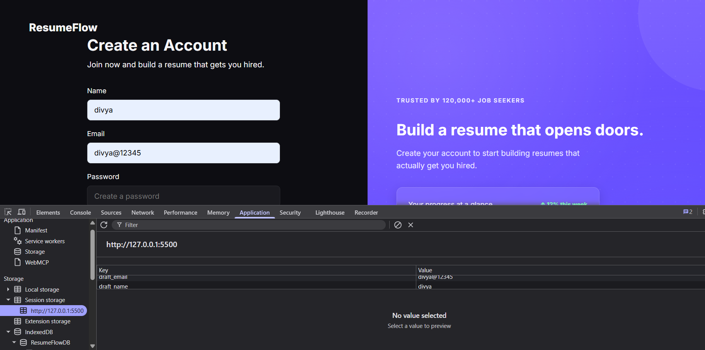
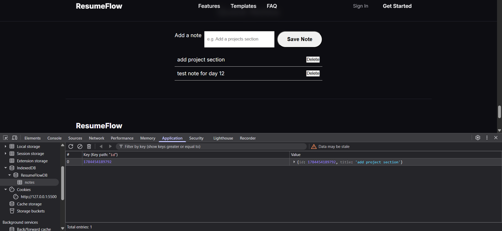

# ResumeFlow — Landing Page

## What this is

This is my weekend build for the Industry-Oriented Full Stack Internship. The task was to build the homepage for an imaginary product called **ResumeFlow**, which helps people create a resume online. The idea is that this is a warm-up for a real resume-building tool we'll build later, so I treated it like the front door of an actual product — something that should look convincing enough that a visitor would actually want to click "Get Started."

## Project info

|               |                                                           |
|---------------|-----------------------------------------------------------|
| **Project**   | Resume-builder marketing landing page (single homepage)   |
| **Tech used** | HTML + CSS, with a small amount of JavaScript             |
| **Repo name** | resume-landing                                            |
| **Hosted on** | GitHub Pages                                              |

## Brand & visual style

Here's how I approached the look and feel:

- **Product name:** ResumeFlow — shown in both the nav bar and the footer
- **Theme:** a dark, modern look — near-black background (`#0d0d12`) with white/off-white text
- **Accent colour:** a purple/indigo shade (`#7c5cff`), used consistently across every button, link, and highlight so it feels like one cohesive brand colour instead of random accents
- **Cards:** every feature, template, and testimonial block is a card with rounded corners, a soft border, and generous internal padding
- **Spacing:** big padding around each section and clear gaps between cards, so nothing feels cramped
- **Typography:** one font throughout — Inter, pulled in from Google Fonts — with large bold headings and one comfortable body text size

## Sections (in order)

The page follows this order, top to bottom:

1. **Navigation bar** — ResumeFlow logo on the left, links to Features / Templates / FAQ, and a "Get Started" button on the right
2. **Hero section** — a large headline, a short one-line description, a primary "Get Started Free" button, and a small reassurance line ("No credit card needed")
3. **Stats strip** — four quick numbers with labels (resumes created, interview rate, average rating, countries supported)
4. **Features section** — a heading plus six feature cards, each with an icon, a title, and a line of description
5. **Templates section** — a heading plus three template preview cards, each with a name, a role, and a short label
6. **Testimonials section** — a heading plus three testimonial cards, each with a star rating, a quote, and the person's name and role
7. **Call-to-action band** — a closing headline and a button to get started
8. **FAQ section** — a heading plus four question-and-answer pairs
9. **Footer** — the product name, a short tagline, three grouped link columns (Product, Company, Legal), and a copyright line

## CSS techniques used

- **CSS variables** — colours, spacing, and radius values are all defined once in `:root` (e.g. `--accent`, `--bg`, `--radius`), so the whole theme can be adjusted from one place instead of hunting through the file.
- **CSS Grid** — used for the stats strip, feature cards, template cards, testimonials, and footer columns, so they lay out in clean rows and reflow automatically on smaller screens.
- **Flexbox** — used in the nav bar to space out the logo, links, and button evenly.
- **Media queries** — breakpoints at 640px and 900px control how many columns each grid section shows, and the nav links hide on narrow screens to keep things clean on mobile.
- **Hover states** — buttons lift slightly and lighten on hover (`transform` + `background-color`), and nav/footer links change colour on hover for feedback.
- **Sticky header** — the nav bar stays fixed at the top while scrolling, using `position: sticky` with a slightly transparent, blurred background (`backdrop-filter: blur()`).
- **Star ratings** — testimonial stars are plain text characters  styled with the accent colour and letter-spacing, instead of separate icon images — a lightweight way to show a rating without extra image files.
- **Reusable card style** — feature, template, testimonial, and stat cards all share the same rounded-corner, bordered, padded look, so the whole page feels consistent without repeating styles from scratch each time.

##screenshot

 
 


## Technical requirements

- **Semantic HTML only** — I used `header`, `nav`, `main`, `section`, `article`, and `footer` throughout. There's no `div` or `span` anywhere in the markup.
- **External CSS** — all styling lives in `style.css`, linked from the `<head>`. No inline styles, no internal `<style>` blocks.
- **Responsive** — built with CSS Grid and Flexbox, and stacks cleanly on narrow/mobile widths using media queries.
- **Accessible basics** — every image has descriptive alt text, and the heading order is logical: exactly one `h1` in the hero, then `h2`s for each section, then `h3`s for card titles.
- **Clean structure** — sensible, readable class names and consistent spacing throughout the CSS.

## JavaScript scope

Since we haven't covered event handling yet, I kept `script.js` intentionally small. It uses `querySelector` and `textContent` to fill in two pieces of the page dynamically instead of hard-coding them:

- The footer copyright year
- The hero headline

## What I learned

- **Semantic HTML makes structure clearer.** Using `header`, `nav`, `main`, `section`, `article`, and `footer` instead of `div` everywhere actually made it easier to know where I was in the page while writing the code.
- **Image paths have to match exactly.** Capitalization, file extension, even one letter off, and the browser just won't show it. I ran into this firsthand after renaming and moving files around — it taught me to set up my `images/` folder and filenames *before* writing the HTML, not after.
- **CSS variables save a lot of repetition.** Using `:root` variables for my colours and spacing meant I could tweak the whole theme from one place instead of hunting through the file.
- **Grid and Flexbox handle responsiveness better than I expected.** Stacking sections on mobile just meant adjusting a few media queries, not rebuilding the layout.
- **Small JS can still be meaningful.** Even without event handlers, using `querySelector` and `textContent` showed me how JavaScript can reach into a page and change it dynamically — a small taste of what's coming next.
- **Following a written spec exactly is a different skill than building freely.** Matching every required section, in order, with the right technical constraints, forced me to slow down and check my work against the brief instead of just going with what looked good.


--------------------  NOTES of what we learn in this project----------------------------------------------


## All HTML Tags Used In This Project

| Tag | Purpose in this project |
|--------------------------|-----------------------------------------------------------|
| `<!DOCTYPE html>`        | Declares HTML5 document                                   |
| `<html lang="en">`       | Root element, sets page language                          |
| `<head>`                 | Metadata container                                        |
| `<meta charset="UTF-8">` | Character encoding                                        |
| `<meta name="viewport">` | Responsive scaling on mobile                              |
| `<title>`                | Browser tab title                                         |
| `<link>`                 | Loads Google Fonts and stylesheets                        |
| `<body>`                 | Page content container                                    |
| `<header>`               | Top navigation wrapper (landing page)                     |
| `<nav>`                  | Navbar and footer link groups                             |
| `<main>`                 | Main content wrapper on every page                        |
| `<section>`              | Hero, stats, features, templates, testimonials,           |
|                          | CTA, FAQ, auth-form-side, auth-form                       |
| `<article>`              | Individual cards: stat cards, feature cards,              | 
|                          | template cards, testimonial cards, FAQ items,             |
|                          |         preview-card                                      |
| `<aside>`                | Auth panel (right-side promotional column)                |
| `<footer>`               | Site footer, and mini-testimonial block inside the        |
|                          |  auth panel                                               |
| `<h1>`                   | Page's main heading                                       |
| `<h2>`                   | Section headings                                          |
| `<h3>`                   | Card-level headings                                       |
| `<h4>`                   | Footer column headings                                    |
| `<p>`                    | Paragraphs, logo text, labels, dividers                   |
| `<a>`                    | All links and button-styled links                         |
| ``                  | Feature icons, template preview images                    |
| `<blockquote>`           | Testimonial quotes                                        |
| `<ul>` / `<li>`          | Nav links, footer links, stats list                       |
| `<form>`                 | Register and login forms                                  |
| `<label>`                | Form field labels                                         |
| `<input>`                | Name, email, password fields                              |
| `<button>`               | Submit buttons                                            |
| `<time>`                 | Dynamic copyright year                                    |
| `<strong>`               | Stat numbers, trend indicator, testimonial name           |
| `<small>`                | Stat labels                                               |
| `<abbr title="...">`     | Avatar initials with tooltip                              |
| `<svg>`                  | Google and Apple icon containers                          |
| `<path>`                 | Vector shapes inside SVG icons                            |
| `<script>`               | Loads script.js                                           |

---


## All CSS Tools / Properties / Concepts Used

### Layout
- `display: flex`, `flex-direction`, `justify-content`, `align-items`, `gap`, `flex: 1`

### Positioning
- `position: relative/absolute`, `top/left/right/bottom`, `z-index`, `overflow: hidden`, `transform: translateY()`

### Backgrounds & Gradients
- `background` shorthand, `linear-gradient()`, `radial-gradient()`, `background-size`

### Visual Effects
- `backdrop-filter: blur()`, `box-shadow`, `border-radius`, `border`, `border-top/bottom`

### Typography
- `font-family`, `font-size`, `font-weight`, `letter-spacing`, `text-transform`, `text-align`, `line-height`, `color`

### Pseudo-classes & Pseudo-elements
- `:hover`, `:focus`, `:first-child`, `:nth-child()`, `::before`, `::after`

### Selectors
- Class selectors, descendant selectors, grouped selectors, direct child combinator (`>`)

### Responsive Design
- `@media (max-width: 800px)` with `order: -1` to reorder stacked layout

### Sizing & Spacing
- `width`, `max-width`, `height`, `padding`, `margin`, `flex-shrink: 0`

---


## Pages Implemented

### `index.html` — Landing Page
Navbar, hero section, stats section, features (6 cards), templates (3 cards), testimonials (3 cards), CTA band, FAQ, footer with 3 link columns.

### `register.html` — Create an Account
Name/Email/Password/Confirm Password form, Google/Apple OAuth buttons, promotional panel with stats and testimonial.

### `login.html` — Sign In
Email/Password form with "Forgot password?" link, Google/Apple OAuth buttons, promotional panel with login-specific copy.

---

## Semantic HTML Rules Followed

No `<div>` or `<span>` anywhere. Every wrapper is a meaningful element:
- Layout wrappers → `<section>`, `<article>`, `<aside>`, `<header>`, `<footer>`, `<nav>`, `<main>`
- List-like data → `<ul>` / `<li>`
- Inline emphasis → `<strong>` / `<small>`
- Avatar with tooltip → `<abbr title="Full Name">`

---

## OAuth Buttons (Google / Apple)

Real inline SVG logos. Icon colors are kept out of the HTML and defined in `auth.css`:

```css
.google-icon path:nth-child(1) { fill: #4285F4; }
.google-icon path:nth-child(2) { fill: #34A853; }
.google-icon path:nth-child(3) { fill: #FBBC05; }
.google-icon path:nth-child(4) { fill: #EA4335; }

.apple-icon path {
  fill: #ffffff;
}
```

---

## JavaScript (`script.js`)


# 1.Toggele password visiblity

 - toggleButtons — selects every eye-icon button on the page.
- handleTogglePassword — flips a password field between hidden (type="password") and visible (type="text").
- data-target on the button tells it which input to control.
- aria-label updates too, for screen reader accessibility.
- forEach wires the click event onto every toggle button found.

# 2. Nav link hover highlight
- highlightLink — changes link color on mouse hover.
- resetLink — removes the color when mouse leaves, falls back to CSS default.
- forEach attaches both listeners to every nav link.

# 3. Theme toggle

- applyTheme — sets data-theme on <body> (CSS reacts to this) and updates the button icon.
- On load, reads the saved theme from Local Storage, defaults to "light" if none exists.
- Click handler flips the theme and saves the new choice with localStorage.setItem().
- Persists even after closing the browser — that's the whole point of Local Storage.
- Wrapped in if (themeToggle) since not every page has this button.

# 4.Session draft for register form




- draftFields — only Name and Email are saved, passwords are never stored.
- First loop — on page load, restores any saved draft into the input fields.
- Second loop — saves the field's value into Session Storage on every keystroke.
- Submit handler — prevents default reload, clears the draft since the form was actually submitted.
- Draft disappears automatically when the tab closes (Session Storage behavior).
- Wrapped in if (registerForm) so it only runs on the register page.

# 5. IndexedDB Setup





- openDatabase — opens/creates the ResumeFlowDB database.
- onupgradeneeded — runs only on first creation, sets up the notes object store.
- onsuccess — saves the open connection into the db variable for other functions to use.
- onerror — logs any failure.
- addNote — inserts a new note with a Date.now() generated id.
- getAllNotes — fetches every saved note, - delivered via a callback since it's async.
- deleteNote — removes a note by its id.
- openDatabase() runs immediately so the DB is ready before the user interacts.

# 6. Note UI wired to indexedDB

- renderNotes — fetches all notes and rebuilds the visible list, each with a Delete button.
- Delete button click — removes the note from IndexedDB, then re-renders the list.
- Form submit — prevents reload, adds the note, clears the input, re-renders the list.
- setTimeout delays used since IndexedDB writes are async — gives the transaction time to finish before re-reading.
- Wrapped in if (noteForm) so it only runs on pages with the Quick Notes section

## Key Takeaways

- Local Storage persists forever until manually cleared — used here for theme, since it should stay set across visits.
- Session Storage clears when the tab closes — used here for the register form draft, since it's only meant to survive an accidental refresh, not a full session.
- IndexedDB stores structured objects (not just strings) and survives indefinitely — used here for notes, since it needs to hold multiple fields per entry (id, title).
- None of the three storage types send data to a server automatically — that's what makes them different from cookies.
- Passwords are never saved in any browser storage, even temporarily — only non-sensitive fields (name, email) are stored in the session draft.
- IndexedDB operations are asynchronous — reads and writes happen through callbacks, not direct return values, so the UI has to wait for confirmation before re-rendering.
- Wrapping page-specific code in `if (element)` checks lets one shared `script.js` file run safely across multiple pages without throwing errors for missing elements.
- `Date.now()` is used consistently as a unique ID generator across the project — same pattern used in the backend models.